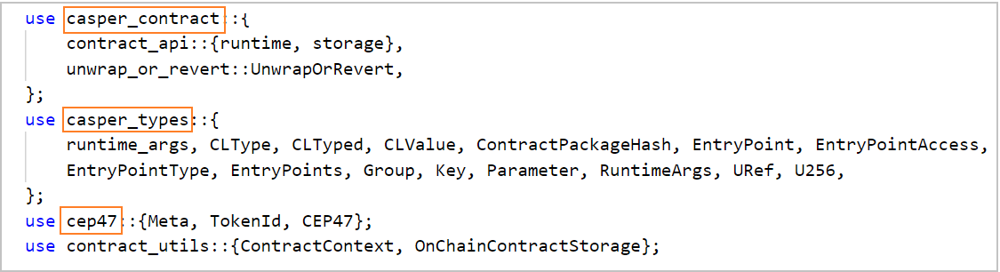
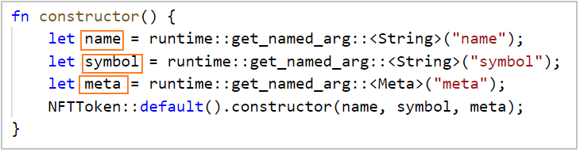

# The NFT Standard on Casper (CEP-47)

This tutorial takes you through the standard of implementing [non-fungible tokens](https://docs.casperlabs.io/glossary/N/#non-fungible-token) on the Casper Network.

## Casper NFT (CEP-47) Functions

The CEP-47 standard contains the following functions to enable NFTs.  

- [*name*](https://github.com/casper-ecosystem/casper-nft-cep47/blob/09b40b0caf4cfc6f73d1e5f7d5b9c868228f7621/cep47/bin/cep47_token.rs#L44-L47) - Returns the name of the NFT contract
- [*symbol*](https://github.com/casper-ecosystem/casper-nft-cep47/blob/09b40b0caf4cfc6f73d1e5f7d5b9c868228f7621/cep47/bin/cep47_token.rs#L50-L53) - Returns the symbol of the NFT contract
- [*meta*](https://github.com/casper-ecosystem/casper-nft-cep47/blob/09b40b0caf4cfc6f73d1e5f7d5b9c868228f7621/cep47/bin/cep47_token.rs#L56-L59) - Returns the metadata of the NFT contract
- [*total_supply*](https://github.com/casper-ecosystem/casper-nft-cep47/blob/09b40b0caf4cfc6f73d1e5f7d5b9c868228f7621/cep47/bin/cep47_token.rs#L62-L65)- Returns the amount of issued NFTs
- [*balance_of*](https://github.com/casper-ecosystem/casper-nft-cep47/blob/09b40b0caf4cfc6f73d1e5f7d5b9c868228f7621/cep47/bin/cep47_token.rs#L68-L72) - Returns the amount of NFT tokens the `owner` holds
- [*get_token_by_index*](https://github.com/casper-ecosystem/casper-nft-cep47/blob/09b40b0caf4cfc6f73d1e5f7d5b9c868228f7621/cep47/bin/cep47_token.rs#L75-L80) - Retrieves the NFT token at a specific index
- [*owner_of*](https://github.com/casper-ecosystem/casper-nft-cep47/blob/09b40b0caf4cfc6f73d1e5f7d5b9c868228f7621/cep47/bin/cep47_token.rs#L83-L87) - Retrieves the owner of a given token
- [*token_meta*](https://github.com/casper-ecosystem/casper-nft-cep47/blob/09b40b0caf4cfc6f73d1e5f7d5b9c868228f7621/cep47/bin/cep47_token.rs#L90-L94) - Retrieves the metadata for a given token
- [*update_token_meta*](https://github.com/casper-ecosystem/casper-nft-cep47/blob/09b40b0caf4cfc6f73d1e5f7d5b9c868228f7621/cep47/bin/cep47_token.rs#L97-L103) -  A function to update the metadata of a token
- [*mint*](https://github.com/casper-ecosystem/casper-nft-cep47/blob/09b40b0caf4cfc6f73d1e5f7d5b9c868228f7621/cep47/bin/cep47_token.rs#L106-L113) - Creates a list of tokens for a specific recipient, given the token IDs and their metadata, paired in order
- [*mint_copies*](https://github.com/casper-ecosystem/casper-nft-cep47/blob/09b40b0caf4cfc6f73d1e5f7d5b9c868228f7621/cep47/bin/cep47_token.rs#L116-L124) - For a given address, this function creates several tokens with specific IDs but with the same metadata
- [*burn*](https://github.com/casper-ecosystem/casper-nft-cep47/blob/09b40b0caf4cfc6f73d1e5f7d5b9c868228f7621/cep47/bin/cep47_token.rs#L127-L133) - Destroys the given tokens in the account given
- [*transfer*](https://github.com/casper-ecosystem/casper-nft-cep47/blob/09b40b0caf4cfc6f73d1e5f7d5b9c868228f7621/cep47/bin/cep47_token.rs#L136-L142) - Transfers tokens to another account
- [*transfer_from*](https://github.com/casper-ecosystem/casper-nft-cep47/blob/09b40b0caf4cfc6f73d1e5f7d5b9c868228f7621/cep47/bin/cep47_token.rs#L145-L152) - Transfer tokens from a given account to another account
- [*approve*](https://github.com/casper-ecosystem/casper-nft-cep47/blob/09b40b0caf4cfc6f73d1e5f7d5b9c868228f7621/cep47/bin/cep47_token.rs#L155-L161) - Gives another account the right to transfer tokens from this account
- [*get_approved*](https://github.com/casper-ecosystem/casper-nft-cep47/blob/09b40b0caf4cfc6f73d1e5f7d5b9c868228f7621/cep47/bin/cep47_token.rs#L164-L169) - Retrieves information about the rights to transfer tokens from another account

**Note**:
These functions can only be called from inside contracts, as they return data:
- *name*, *symbol*, *meta*, and *total_supply*: Return details regarding the whole contract
- *balance_of* and *get_token_by_index*: Retrieve details of tokens related to a specific account
- *owner_of* and *token_meta*: Retrieve the details of a specific token

## Sample Contract Implementation

This section will explore the [smart contract](https://github.com/casper-ecosystem/casper-nft-cep47/blob/master/cep47/bin/cep47_token.rs) introduced in this repository to implement the NFT standard for the Casper Network. To successfully execute this reference contract, you must copy the entire contract file with all the necessary imports, declarations, and functions. To execute the contract, you need to deploy the Wasm file on the network.

First clone this repository:

```bash
git clone https://github.com/casper-ecosystem/casper-nft-cep47.git
```

### Review the required crates
This sample NFT contract requires the following crates to function correctly:
- [casper_contract](https://docs.rs/casper-contract/latest/casper_contract/) - A Rust library for writing smart contracts on the Casper Network
- [casper_types](https://docs.rs/casper-types/latest/casper_types/) - Types used to allow the creation of Wasm contracts and tests for use on the Casper Network
- cep47 - A library for implementing NFTs following the CEP-47 standard on Casper



### Constructing the contract    
The constructor uses three arguments to initialize the contract:
- `name` - Name of the NFT token 
- `symbol` - Symbol of the NFT token 
- `meta` - Metadata about the NFT token




### Implementing the contract endpoints
Contract endpoints handle token operations with your account and other accounts. Refer to the list of [endpoints](#casper-nft-cep-47-functions) in the introduction section and [endpoint event stream](/Contract-Interaction-Tutorial.md) details in the token management section.

## Sending the Contract to the Network

Now that you have implemented the NFT contract, it's time to send it to the network. You will use a JavaScript client with in-built TypeScript (TS) classes to send a deploy. The JS client also resides in a separate repository. Clone that repository to your machine and proceed with these steps.

### Prerequisites to send the deploy
- Set up your machine as per the [prerequisites](https://docs.casperlabs.io/workflow/setup/)
- Ensure you have [set up an account](https://docs.casperlabs.io/workflow/setup/#setting-up-an-account) with a public and secret key pair to initiate the deploy
- Since we are deploying to the Casper Testnet, ensure your [Testnet faucet account](https://testnet.cspr.live/tools/faucet) contains enough CSPR tokens to perform the contract execution. Follow [fund your account](https://docs.casperlabs.io//workflow/setup#fund-your-account) guide to add CSPR tokens to your account
- CSPR tokens are used to pay for the transactions on the Casper Network. Follow the [transfer tokens](https://docs.casperlabs.io//workflow/token-transfer#2-the-faucet) guide to learn more about token transferring on the Casper Testnet

### Steps to install the NFT contract

Here are the basic steps for sending this contract to the network using the JS client.


### Clone the required repositories

You will be using these two Casper repositories to install the contract:
-  This [casper-nft-cep47](https://github.com/casper-ecosystem/casper-nft-cep47) repository, contains the *cep47-token.wasm* file needed for the deploy. The Wasm file is the compiled implementation of the contract.
- The [casper-contracts-js-clients](https://github.com/casper-network/casper-contracts-js-clients) repository contains a JS client for the NFT contract and other supporting classes. You will be executing the [install.ts](https://github.com/casper-network/casper-contracts-js-clients/blob/master/e2e/cep47/install.ts) file to install the contract on the network.

### Send the deploy to the network

**Prepare the CEP-47 contract repository**

This step will set up the build environment, create the target location and compile the contract to a Wasm file. The output from this step would be a Wasm file (Eg: *cep47-token.wasm*), which is later used by the JS client to send the deploy.

Move to the `casper-nft-cep47` cloned folder and prepare your environment with the following command:

```bash
cd casper-nft-cep47
make prepare
```

If your environment is set up correctly, you will see this output:

```bash
rustup target add wasm32-unknown-unknown
info: component 'rust-std' for target 'wasm32-unknown-unknown' is up to date
```

If you do not see this message, check the [getting started guide](https://docs.casperlabs.io/dapp-dev-guide/getting-started/).

Next, compile your contract and run the contract unit tests.

```bash
make build-contract
make test
```

**Prepare the JS client repository**

The JS client can be used to install the smart contract on the Casper Network and perform further actions with the contract. We are using the JS client classes to invoke the NFT installation on the network using a pre-defined set of environment variables.

Clone the [casper-contracts-js-clients](https://github.com/casper-network/casper-contracts-js-clients) repository using the following command.

```
git clone https://github.com/casper-network/casper-contracts-js-clients.git
```

**Add the environment variables for the client**

In the root folder of the `casper-contracts-js-clients` repository, copy or rename the example .env file from *.env.cep47.example* to *.env.cep47*:

```bash
  cd casper-contracts-js-clients
  cp .env.cep47.example .env.cep47
```

In the *.env.cep47* file, replace the following values with your own:

- `WASM_PATH` - Path to the compiled *cep47-token.wasm* file
- `CHAIN_NAME` - Network name, e.g. *casper* for Mainnet or *casper-test* for Testnet
- `NODE_ADDRESS ` - Address of the node's JSON-RPC server. Use port 7777 or whatever is specified as the *rpc_server.address* in the node's config.toml, and append */rpc* to the path. Example: 195.201.174.222:7777/rpc
- `EVENT_STREAM_ADDRESS`: Address of the node's event stream server. Use port 9999 or whatever is specified as the *event_stream_server.address* in the node's config.toml, and append  */events/main* to the path. Example: 195.201.174.222:9999/events/main
- `MASTER_KEY_PAIR_PATH` - Path to the generated key pair for your signature
- `USER_KEY_PAIR_PATH` - Path to the generated key pair, which in this case would be the same as your `MASTER_KEY_PAIR_PATH` (In certain test scenarios, this could be a different key pair)

**Note**
You must update the above list of parameters to align with your working environment. If you need an IP address for a node on the network, [follow this guide](https://docs.casperlabs.io/workflow/setup/#acquire-node-address-from-network-peers).


**Build the JS client**

Run the following commands to install the dependencies and build the client:

```bash
npm install
npm run dist
```

**Send the deploy to the network**

Run the following command to deploy and execute the CEP-47 installer. The command executes the *./e2e/cep47/install.ts* file.

```bash
npm run e2e:cep47:install
```
 
A Successful command execution produces similar output as below.

<details>
<summary>Console output for contract installation </summary>

```bash
... Contract installation deployHash: 0dcef7e7bddbc5a666aff1afbc03cf4797e3736c71fe05aee9944a26c4eeefab
... Contract installed successfully.
... Account Info:
{
  "_accountHash": "account-hash-179cd876d5c74317cce9c48d718a040e6e909063d7d786de0c5c6421a09fa803",
  "namedKeys": [
    {
      "name": "bdk_nft_contract_contract_hash",
      "key": "hash-a47d35d835a5fa8a1bcd55a4426dc14e21da9b876c1617742f18813737a4ece0"
    },
    {
      "name": "bdk_nft_contract_contract_hash_wrapped",
      "key": "uref-ff9b562d357d9a258acb2b3798f82c6ec5db49a8852e2e96b0ed4b1faf873206-007"
    },
    {
      "name": "contract_package_hash",
      "key": "hash-2468facdc9a6f324f8442584fd46d911e3ac9b434dfa79435567bf71f9b8bd23"
    }
  ],
  "mainPurse": "uref-a33e25cb1e6baa38e8306dba0492183c65cb41db3dbe8f69546868a4c0cfd0d9-007",
  "associatedKeys": [
    {
      "accountHash": "account-hash-179cd876d5c74317cce9c48d718a040e6e909063d7d786de0c5c6421a09fa803",
      "weight": 1
    }
  ],
  "actionThresholds": {
    "deployment": 1,
    "keyManagement": 1
  }
}
... Contract Hash: hash-a47d35d835a5fa8a1bcd55a4426dc14e21da9b876c1617742f18813737a4ece0

```

</details>
<br></br>

Let's look at the [install.ts](https://github.com/casper-network/casper-contracts-js-clients/blob/master/e2e/cep47/install.ts).

First, the client reads the contents of the Wasm file into the `getBinary` constant.
```javascript
export const getBinary = (pathToBinary: string) => {
  return new Uint8Array(fs.readFileSync(pathToBinary, null).buffer);
};
```

Then, it creates the token metadata fetched from the *.env.cep47* file.

```javascript
const TOKEN_META = new Map(parseTokenMeta(process.env.TOKEN_META!));
```
It also fetches the keys for signing from the .env.cep47 file.

```javascript
const KEYS = Keys.Ed25519.parseKeyFiles(
  `${MASTER_KEY_PAIR_PATH}/public_key.pem`,
  `${MASTER_KEY_PAIR_PATH}/secret_key.pem`
);
```

Then, it fetches the node address and chain name of the network being targeted.

```javascript
const test = async () => {
  const cep47 = new CEP47Client(
    NODE_ADDRESS!,
    CHAIN_NAME!
  ); 
```

Next, it runs the installer by calling `cep47.install()`. This function takes the Wasm file path, token metadata, payment amount, and keys as parameters. The result is stored in `installDeployHash`.


```javascript
const installDeployHash = await cep47.install(
    getBinary(WASM_PATH!),
    {
      name: TOKEN_NAME!,
      contractName: CONTRACT_NAME!,
      symbol: TOKEN_SYMBOL!,
      meta: TOKEN_META
    },
    INSTALL_PAYMENT_AMOUNT!,
    KEYS.publicKey,
    [KEYS],
  );
```

Then the generated installation deploy hash is sent to the node address that you specified in the .env file. At this point, you can see the "... Contract installation deployHash:" message on the console output.

```javascript
const hash = await installDeployHash.send(NODE_ADDRESS!);
```

After that, check if the deploy is successful and retrieve the account information using the node address and public key. Next, you can see the "Contract installed successfully." message on the console.

```javascript
await getDeploy(NODE_ADDRESS!, hash)
let accountInfo = await getAccountInfo(NODE_ADDRESS!, KEYS.publicKey);
```

Finally, the contract hash is derived from account information, and you can check the installed contract hash on the console.
```javascript
 const contractHash = await getAccountNamedKeyValue(
    accountInfo,
    `${CONTRACT_NAME!}_contract_hash`
  );
```
<br></br>

Visit [Contract Interaction and Events Tutorial](/Contract-Interaction-Tutorial.md) to get more details about NFT contract events and how to enable each event type with examples.